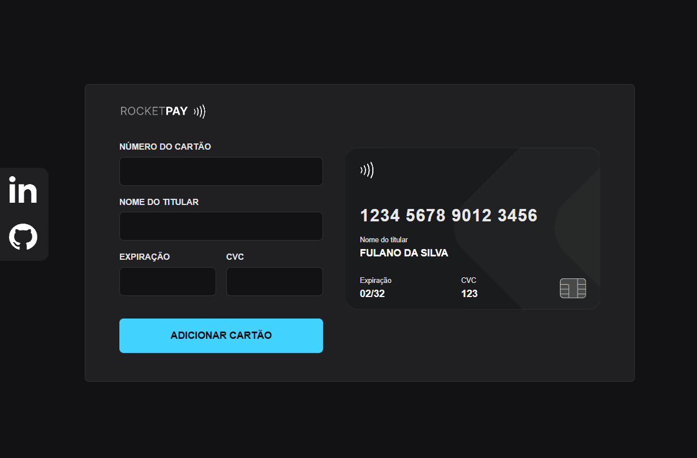
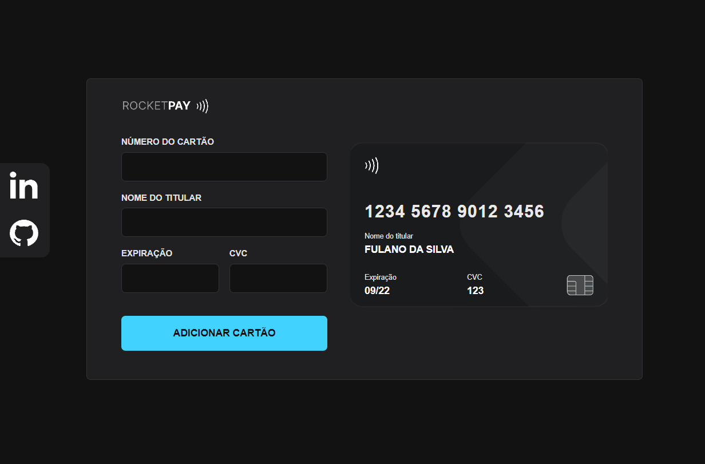
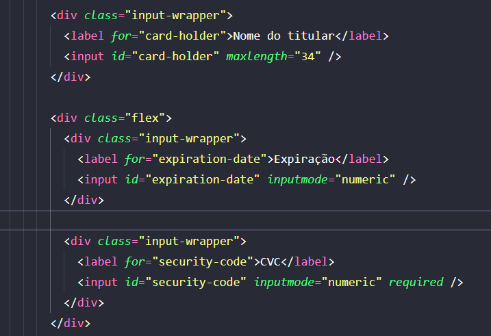

<h1 align="center"> Explorer Lab #01 </h1>

Evento que participei promovido pela Rocketseat para ensino de tecnologias WEB.

  <a href="#-tecnologias">Tecnologias</a>&nbsp;&nbsp;&nbsp;|&nbsp;&nbsp;&nbsp;
  <a href="#-projeto">Projeto</a>&nbsp;&nbsp;&nbsp;

 

  

  

## 🚀 Tecnologias

Esse projeto foi desenvolvido com as seguintes tecnologias:

- HTML e CSS
- JavaScript e JSON
- [Node e NPM](https://nodejs.org/)
- [Vite](https://vitejs.dev/)
- [iMask](https://imask.js.org)

## 💻 Projeto

O Rocketpay é um componente que simula o formulário de preenchimento de cartão de crédito, onde é possível adicionar máscara aos inputs e atualizar elementos HTML via DOM.

## 🔖 Mundanças feitas por mim

- Cartões (mudando o svg e logo)
- Modal
- Validações com feedback e não permitir números no nome do titular
- Link lateral para Github e Linkedin

  

## 📱 Mobile

  

## 🧠 Atributos para usar teclado numérico no mobile

  

---

Feito com ♥ by Wallace Bezerra

  

